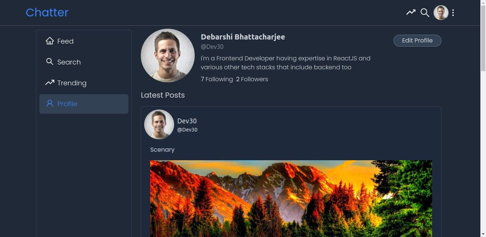
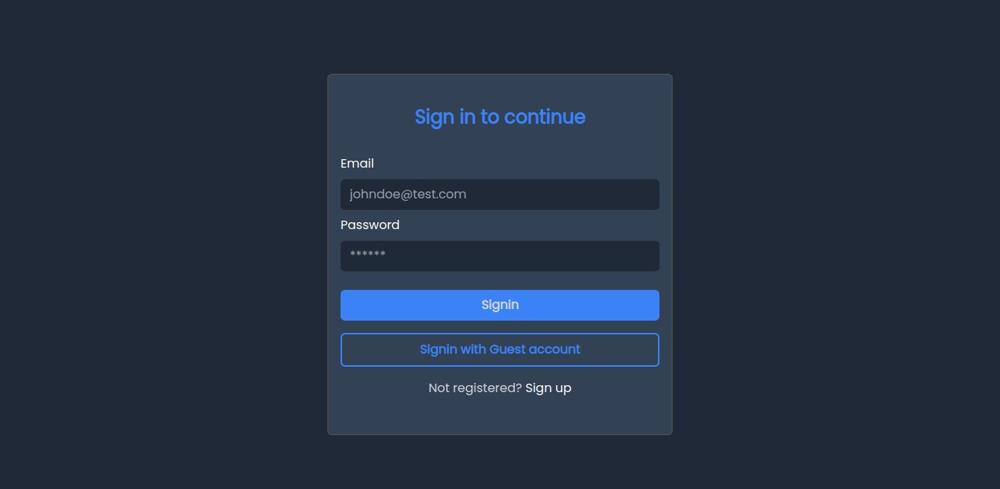
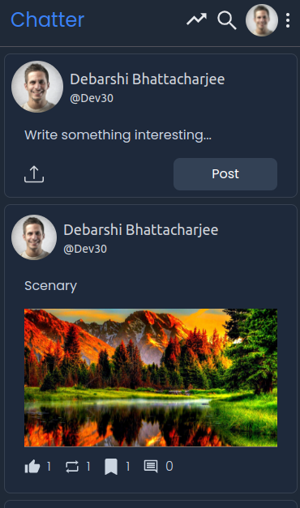

[](https://github.com/Debarshi95/Chatter/actions)

# Chatter

A reactjs app similar to Twitter. Made with ReactJS, Redux-Toolkit and TailwindCSS

## Demo

[Deployed on Netlify using github actions](https://debarshib-chatter.netlify.app)

## Features:

- Authentication facility for old & new users
- Authenticated users can
  - create new post
  - comment and reply on others post
  - bookmark, like, unlike, retweet a post
  - Delete a post
- Provides user feed about their post and people their following
- Trending page where trending posts are listed.
- Filteration of trending posts based on comments, likes, retweets
- A user can update their profile picture, bio, username
- One user can explore other user's feed
- LazyLoading/Code-splitting of components to dynamically load at runtime
- Error management using ErrorBoundary to catch and show fallback UI.
- Loading Spinner when fetching initial data.
- Responsive UI for all screens (Desktop, Tablet, Mobile)

## Built using:

- [ReactJS](https://reactjs.org/) - Frontend framework
- [React Router](https://reactrouter.com/) - For routing & navigation
- [React-Hot-Toast](https://react-hot-toast.com) - to show Toast Notifications
- [ReduxToolkit](https://redux-toolkit.js.org/) - For centralized state management
- [TailwindCSS](https://tailwindcss.com/) - For UI styles

## Screenshots

#### Desktop







<br/>

#### Mobile

<br/>
<div align="center">




</div>

## Run Locally

- Clone the project
  `git clone https://github.com/Debarshi95/Chatter.git`
- Go to the project directory
- cd chatter
- Install dependencies
  `yarn`
- Create a **.env** file
- Create a project inside Google Firebase and export the configuration
- Add the following configuration to your .env file

```
REACT_APP_API_KEY="<Firebase API_KEY>"
REACT_APP_AUTH_DOMAIN="<Firebase AUTH_DOMAIN>"
REACT_APP_PROJECT_ID="<Firebase PROJECT_ID>"
REACT_APP_STORAGE_BUCKET="<Firebase STORAGE_BUCKET>"
REACT_APP_MESSAGING_SENDER_ID="<Firebase MESSAGING_SENDER_ID>"
REACT_APP_APP_ID="<Firebase APP_ID>"
```

- Start the server
  `yarn start`
